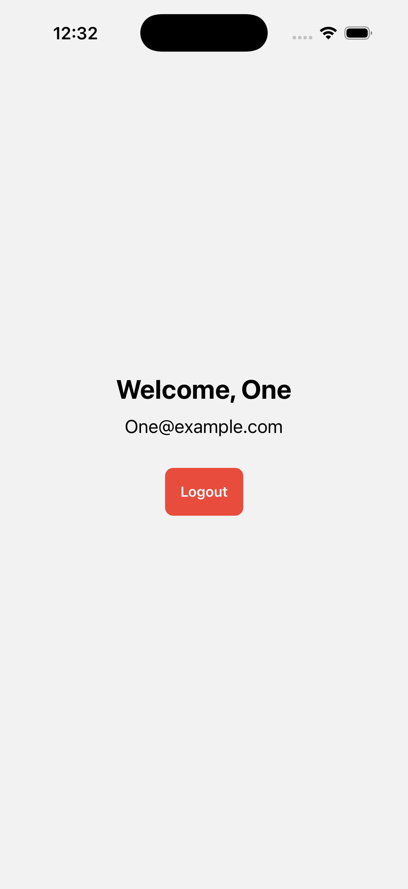

This is a new [**React Native**](https://reactnative.dev) project, bootstrapped using [`@react-native-community/cli`](https://github.com/react-native-community/cli).

# User Authentication App (React Native)

**Note**: This is a simple authentication app built with React Native CLI, created as part of a developer assessment.
The goal was to put together a small but complete auth flow using React Navigation, Context API, and AsyncStorage.

The app supports both iOS and Android.

## What the app does

### ✔ Signup
```sh
- Validates name, email, and password

- Ensures email has valid format

- Password must be minimum 6 characters

- Email is normalized to avoid iOS auto-capitalization issues

- A new user is added to AsyncStorage → "users"

- User is automatically logged in and navigated to the Home screen
```
### ✔ Login
```sh
- Input email is normalized (trimmed + lowercased)

- Reads the "users" list from AsyncStorage

- Compares credentials

- Shows inline error messages for incorrect attempts

On success:

-> Saves user to "user" key

-> Navigates to Home screen
```

### ✔ Home Screen
```sh
- Retrieves active user from global context

- Displays:

-> Name

-> Email

- Logout button clears "user" from AsyncStorage and resets state
```

### ✔ Password Visibility Toggle
```sh
- Implemented using react-native-vector-icons

- Allows user to toggle password between hidden/shown

- Works on both Android and iOS
```

## Tech Used

```sh
- React Native CLI

iOS:

-> Input autocapitalization disabled

-> Email normalization added

-> Vector icons autolinked

Android:

-> Gradle autolinking used

-> Font fixes applied for vector icons


- React Navigation Stack

- AsyncStorage (@react-native-async-storage/async-storage)

- Context API for global auth state

- react-native-vector-icons for the eye icon

Everything is implemented without any backend — all data is stored locally on the device.
```

## Project Structure

```sh
src/
 ├── context/
 │     └── AuthContext.js     # Authentication logic (signup, login, logout)
 ├── navigation/
 │     └── AppNavigator.js    # Controls which screen loads
 └── screens/
       ├── LoginScreen.js
       ├── SignupScreen.js
       └── HomeScreen.js
App.js                         # Root file wrapping everything with AuthProvider

```

## Step 1:  Install dependencies
Before running the project, make sure you have:

Node.js : **v25.2.1**

JAVA : **v17.0.17**


### Android Studio
Android Studio Otter

Android Virtual Device (AVD) installed

ANDROID_HOME properly configured

### Xcode (for macOS/iOS)
Xcode:** v26.1.1**

React Native CLI tools

```sh
npm install -g react-native-cli
```

```sh
npm install
```

## Step 2: Build and run your app

### Android setup

Make sure your emulator is running:

```sh
npx react-native run-android
```

### iOS setup

```sh
cd ios
pod install
cd ..
```

 Run the app

```sh
npx react-native run-ios
```

If everything is set up correctly, you should see your new app running in the Android Emulator, iOS Simulator, or your connected device.


## 📸 Screenshots

### **Login Screen**
<table>
<tr>
<td></td>
<td></td>
</tr>
<tr>
<td align="center">iOS</td>
<td align="center">Android</td>
</tr>
</table>

---

### **Signup Screen**
<table>
<tr>
<td></td>
<td></td>
</tr>
<tr>
<td align="center">iOS</td>
<td align="center">Android</td>
</tr>
</table>

---

### **Home Screen**
<table>
<tr>
<td></td>
<td></td>
</tr>
<tr>
<td align="center">iOS</td>
<td align="center">Android</td>
</tr>
</table>


